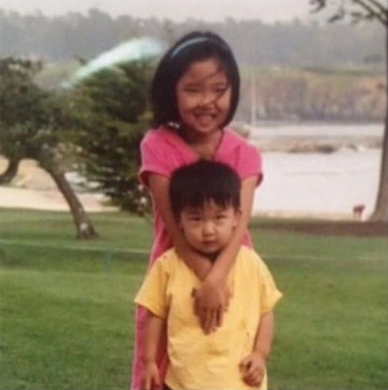

Hi! This technically isn't my first post, but given that my previous post was more
about testing the website, I wanted to write a more proper introduction about myself,
my goals for this blog, and my general thoughts on life.

For starters, my name is Choong Jae Lee, but I really go by CJ. If you're familiar at all with Korean
names, you might realize that I am Korean! I was born in Tucson, Arizona in 2002,
as the second child to two amazing parents, who had immigrated with my sister
from South Korea 3 years earlier. I don't remember much about Tucson, because when
I was 3, I moved to Lawton, Oklahoma, where I lived for 11 years. My most recent
(and current) destination was Ridgewood, New Jersey, where I've been living for
the past 6 years. Although I lived in Oklahoma for the largest chunk of my life,
I'm never sure whether I consider Lawton or Ridgewood to by my _hometown_, because
Ridgewood is the place where I graduated from high school and _finished_ my childhood
(which feels a little weird to say).

<ImgCaption caption="My and my sister somewhere on a golf course in Tucson">

</ImgCaption>

Regardless, I consider every place I've lived to
have been incredibly pivotal in giving me the experiences and knowledge to make me
the person I am today. Although none of it was easy, especially for my parents, who
worked tirelessly to give me all the opportunties they could - even if it meant sacrificing
their own - I'm grateful for it all.

After my earlier years, I'm now an undergraduate at Cornell University, in Ithaca, New York!
I might make another blog post in the future about how I ended up here, but I'm
grateful for being able to attend such an amazing university. I'm majoring in Computer
Science (with additional majors/minors TBD), mainly because I've always loved working with
computers, and I feel like technology comes second-nature to me. Luckily, Cornell has an
excellent CS program, and I've been able to take such interesting classes and meet
incredible friends in the middle of... nowhere. But even through the late nights and
waves of stress, I've truly loved every part of the experience so far, and
I hope to make the most of my remaining two and a half years.

So, with the bulk of my autobiography out of the way: Why did I make this website?
Well, for one, I've just always reallly wanted to. When I was in elementary school, I used to
be oddly fascinated with potatoes, and I always dreamed about getting the potato.com
domain and just... playing around with it. I didn't really ever have a goal in mind, other
than to make it potato-related.

But aside from that childhood goal, I thought that building a
personal website would be good for 3 more reasons:

- branding and marketing myself professionally,
- further developing my web development skills,
- and writing this blog.

Regarding the first two reasons, it feels empowering to go from nothing to
having my own _logo_, even though it may just be 3 colored characters. I also feel like
I've improved immensely with familiarizing myself with general web design paradigms and
working with frameworks like React/Gatsby. Similarly, I've learned more about
the full stack space in general, what-with the countless frontend/backend/stack technologies
out there.

But most of all, I've also always wanted to set up my personal blog to
really solidify my own place on the Internet. To throw my thoughts out into the great
cyber world, if not for other people, at least so that I put my mind to paper/bytes
and actualize my thoughts more concretely.

Indeed, as I've gone from high schooler to college student, I've noticed a change
in my thoughts. I think I've always been a pensive guy, but I've really been getting
more into thinking deeply about my identity, my goals, the world, and really anything
and everything. I've definitely grown a deeper appreciation for philosophy (although
I admit that I've yet to take a corresponding class at Cornell), and I've realized that
I need to do better in recording my thoughts and conclusions so that I can build on
my thinking, rather than incubating haphazard and repetitive speculations.

To that end, I hope I can use this blog as a fun exercise to solidify some interesting ideas I may have,
although I've also been thinking that I should really start a more personal journal/diary
for a place where I can write without limits.

But yeah, that's pretty much it for now. It's a little past 4 AM from when I'm writing
this, and I have to wake up _slightly_ early (12 PM) to go thrifting with some
friends, so I should sign off now to put some finishing touches and push this secondly first
post to the live site.

Adios, and stay romantic.
